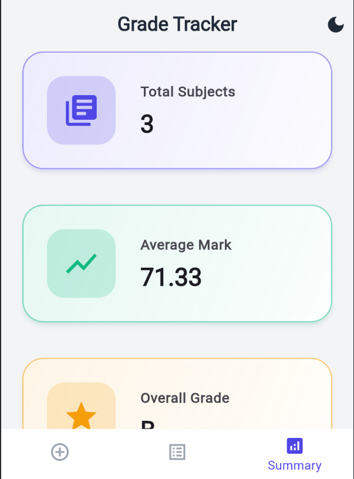
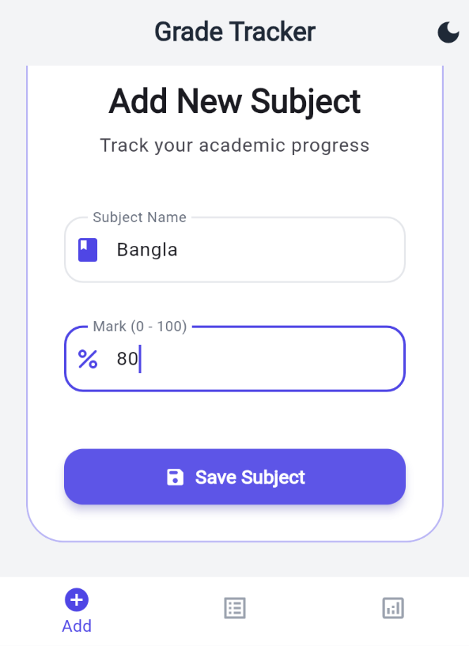
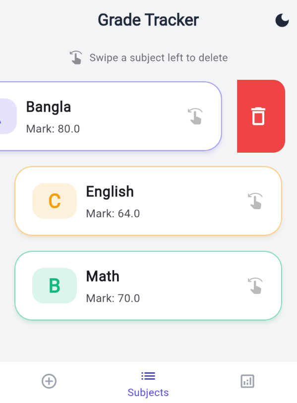

# 🎓 Student Grade Tracker


A modern, highly-polished Flutter application built for students to track their academic progress seamlessly. Designed with a premium **Material 3 UI** and driven by a robust **clean architecture**, this app provides a flawless user experience for managing subjects, calculating grades, and visualizing academic summaries.

---

## 📸 Screenshots

| Add Subject (Light Theme) | Add Subject (Dark Theme) | Summary Dashboard |
| :---: | :---: | :---: |
|  |  |  |

| Subject List | Save Marks | Dismissible Card |
| :---: | :---: | :---: |
|  |  |  |

---

## ✨ Features

- **📊 Live Dashboard**: View your Total Subjects, Average Mark, and Overall Grade at a glance, updated instantaneously.
- **📝 Add Subjects**: Easily input subjects with their corresponding marks (0-100) using a carefully validated, user-friendly form.
- **📱 Subject Management**: Browse all your subjects in an elegant list. Need to delete one? Simply **swipe left**!
- **🎨 Premium UI/UX**: Enjoy carefully crafted cards with translucent colored borders, soft shadows, and dynamic gradient elements. 
- **🌓 Light & Dark Mode**: Fully customized, bespoke Light and Dark themes that you can toggle directly from the AppBar.
- **⚡ Zero `setState()`**: State management is handled 100% via `Provider`, guaranteeing scalable and reactive code.

---

## 🏛️ Architecture & State Management

The application is engineered strictly relying on the **Provider** pattern to manage state.

- **`SubjectProvider`**: The core data manager. It holds the `List<Subject>` and dynamically computes averages and grades utilizing `.map()` and `.where()`.
- **`ThemeProvider`**: Listens and updates the app-wide theme in real-time.
- **No StatefulWidgets**: Boilerplate code has been completely abstracted away. You will not find a single `setState()` or `StatefulWidget` in the `lib` directory!

### 📂 Folder Structure
```text
lib/
├── models/             # Business objects (Subject with private fields & getters)
├── providers/          # State managers (SubjectProvider, ThemeProvider, etc.)
├── screens/            # Application views (Add Subject, Subject List, Summary)
├── theme/              # Custom Material 3 Light/Dark Theme configurations
├── widgets/            # Reusable UI components (SubjectCard, SummaryCard, etc.)
└── main.dart           # App entry point & MultiProvider initialization
```

---

## 🚀 How to Run the Project

1. **Verify Prerequisites**: Make sure Flutter is installed on your machine (`flutter --version`).
2. **Clone the Repository**:
   ```bash
   git clone https://github.com/rhsohan/student_grade_tracker_app.git
   cd student_grade_tracker_app/student_grade_tracker
   ```
3. **Install Dependencies**:
   ```bash
   flutter pub get
   ```
4. **Run the App**:
   ```bash
   flutter run
   ```
   *(We recommend running on Chrome for Web or an iOS/Android Simulator to enjoy the premium design!)*

---

## 🛠️ Built With

- **[Flutter](https://flutter.dev/)** - UI Toolkit for building natively compiled applications.
- **[Provider](https://pub.dev/packages/provider)** - State management solution.

---

*Designed and engineered to achieve top marks.* 🎓
